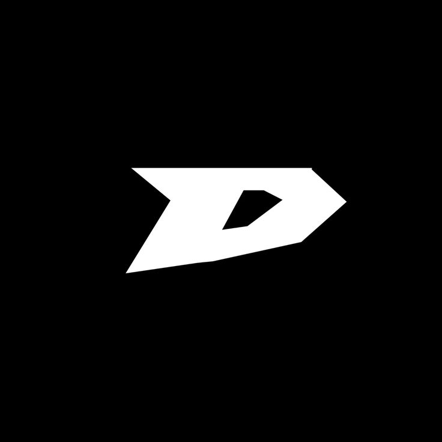

<div align="center">

<h1>Drift</h1>
<p>
A Keyless Script Hub for Roblox. To check supported games, report bugs or make suggestions please join our <a href="https://dsc.gg/getdrift">Discord</a>!
</p>
</div>

> [!WARNING]
> **Keyless** means there is no key system, but you will need to obtain a key that is updated regularly from our Discord server.

## Get the script

```lua
loadstring(game:HttpGet("https://raw.githubusercontent.com/cryp1t/Drift/refs/heads/main/main.lua", true))()
```

<p align="center">
Made by <strong>cryp11t</strong> & <strong>ardin6</strong>
</p>
